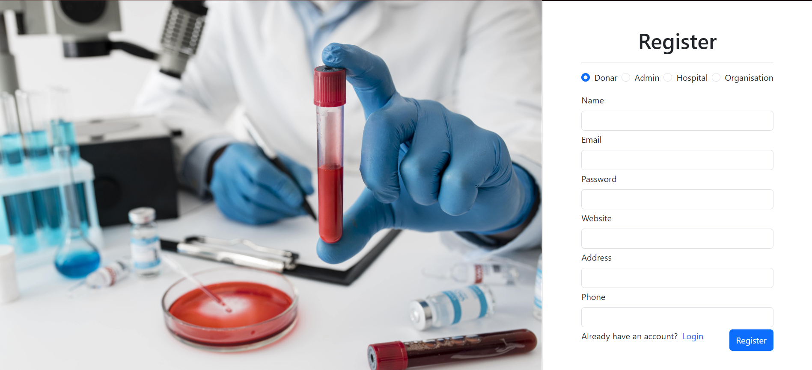
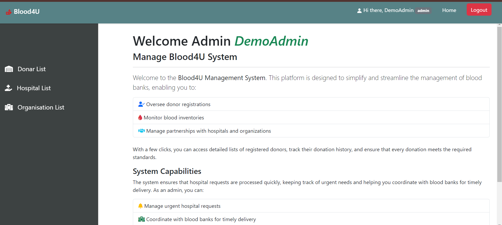

# Blood4U - Blood Bank Management Application

A full-stack web application designed to streamline blood donation processes, facilitate coordination between donors, hospitals, blood banks, and organizations, and enable real-time blood stock management.

## Table of Contents

- [Project Overview](#project-overview)
- [Features](#features)
- [Technologies Used](#technologies-used)
- [Project Architecture](#project-architecture)
- [Database Structure](#database-structure)
- [Screenshots](#screenshots)
- [Project Modules](#project-modules)
- [Usage](#usage)
- [Benefits](#benefits)
- [Future Improvements](#future-improvements)

---

## Project Overview

**Blood4U** is a comprehensive **Blood Bank Management Application** designed to streamline and enhance the process of blood donation, tracking, and inventory management. This platform connects **donors**, **hospitals**, **organizations**, and **admin** to ensure smooth blood donation processes, efficient blood stock management, and quicker response times during emergencies.

The primary goal of the **Blood4U** application is to simplify the coordination between blood donors, hospitals, and blood banks, and to provide a **real-time solution** for tracking blood stock availability. By managing blood donation events, user registrations, blood requests, and blood stock, **Blood4U** ensures that hospitals and organizations have easy access to the blood supply when needed most.

---

## Features

- **Real-time Blood Stock Management**: Blood banks and hospitals can instantly update and monitor the availability of different blood types in real-time, ensuring that any hospital or organization can instantly see available blood stocks.
- **Multiple User Roles**: The system supports four primary user roles:

  - **Donors** can register, manage their donation history, and discover donation events near them.
  - **Hospitals** can check the availability of blood stocks, place blood requests, and track blood delivery from banks.
  - **Organizations** can organize and manage blood donation camps and events.
  - **Admin** has full access to all functionalities, including managing users, blood stocks, and system logs.

- **Secure User Registration and Authentication**: With the use of **JSON Web Tokens (JWT)** for user authentication, the system ensures that only authorized individuals can access sensitive information based on their roles (e.g., hospital staff, admin).

- **Event Management**: Organizations can create and manage blood donation events, allowing donors to sign up and participate, thereby increasing the number of available donations for hospitals and blood banks.

- **Hospital Blood Requests**: Hospitals can log in to search for required blood types, place requests for blood, and manage their needs accordingly, ensuring a fast and efficient supply during critical moments.

- **Admin Dashboard**: The admin panel provides full control over users and system data, enabling administrators to monitor donation activities, approve events, track stock levels, and ensure the system runs smoothly.

---

## Problem Solved

The blood donation process in many regions remains slow and inefficient, with limited coordination between blood banks, hospitals, and donors. This leads to:

- Delays in obtaining blood in emergencies.
- Inefficient tracking of blood stock levels across locations.
- Lack of streamlined communication between stakeholders.

**Blood4U** solves these problems by:

- Providing a **centralized platform** for all users involved in the blood donation process.
- Enabling **real-time updates** on blood stock levels.
- Facilitating easy coordination between hospitals, donors, and organizations.

---

## How the Application Works

1. **Donor**: A donor can register securely on the platform, view their donation history, and sign up for upcoming blood donation camps organized by different organizations.

2. **Hospital**: Hospitals can log into the system, check the availability of blood types in nearby blood banks, and place specific blood requests for urgent needs. The system updates in real time as the inventory changes.

3. **Organization**: Organizations can create events where they invite donors to participate in donation camps. These events are publicly listed on the platform, and interested donors can sign up directly.

4. **Admin**: Admins have complete control over the system and can manage users, blood stocks, donation events, and hospital requests.

---

## Technologies Used

- **Frontend**: React.js
- **Backend**: Node.js, Express.js
- **Database**: MongoDB
- **Authentication**: JSON Web Tokens (JWT)
- **Real-Time Updates**: WebSocket

---

## Project Architecture

The Blood4U application follows a **MERN stack architecture** with the following layers:

- **Client-Side (React)**: Handles user interactions, data display, and API calls.
- **Server-Side (Express & Node.js)**: Processes client requests, manages business logic, and communicates with the database.
- **Database (MongoDB)**: Stores data on users, blood stocks, donation events, and hospital requests.

---

## Screenshots

To provide a visual representation of the project :

_Figure 1: Blood4U Homepage_

_Figure 2: Donor Registration Form_

_Figure 3: Admin Home Page_

---

## Database Structure

In this project i have used two tables **Users** to store the information about the users and **Inventories** to manage the inventory information of the different blood types.

- **Users**: A single table for all roles (Donor, Hospital, Organization, Admin) with fields such as user role, name, contact info, and other relevant details.
- **Inventories**: Tracks real-time availability of different blood types, including stock levels and associated locations.

---

## Project Modules

1. **User Management**:

   - Handles role-based registration and login with secure access control.

2. **Blood Stock Management**:

   - Real-time updates on blood stock levels across locations.

3. **Hospital Blood Requests**:

   - Allows hospitals to place requests for specific blood types and track fulfillment.

4. **Event Management**:

   - Allows organizations to set up blood donation events and enables donors to register.

5. **Admin Dashboard**:
   - Provides a comprehensive view of the system for the admin to monitor and manage activities.

---

## Usage

1. **Donor**: Registers, views donation history, and checks nearby events.
2. **Hospital**: Logs in to view and request blood stock.
3. **Organization**: Creates donation events and tracks participants.
4. **Admin**: Manages all system activities, overseeing users, stocks, and events.

---

## Benefits

- **Improved Coordination**: Real-time tracking of blood stocks helps hospitals place requests with greater confidence, ensuring they get the blood they need during emergencies.
- **Increased Donor Engagement**: Donors can easily find events and track their donation history, encouraging regular donations.
- **Scalable Platform**: The application can scale to support more users and locations, allowing blood banks across various regions to collaborate.
- **Efficient Resource Management**: Blood banks and hospitals can manage and update their stock levels seamlessly, ensuring better preparedness in case of emergencies.

---

## Future Improvements

Potential enhancements for the Blood4U application include:

- **Mobile Application**: A mobile version to make the platform more accessible.
- **Notification System**: Real-time notifications for donors and hospitals on request statuses and eligibility.
- **Data Analytics**: A reporting feature for administrators to analyze donation trends and stock availability.

---
